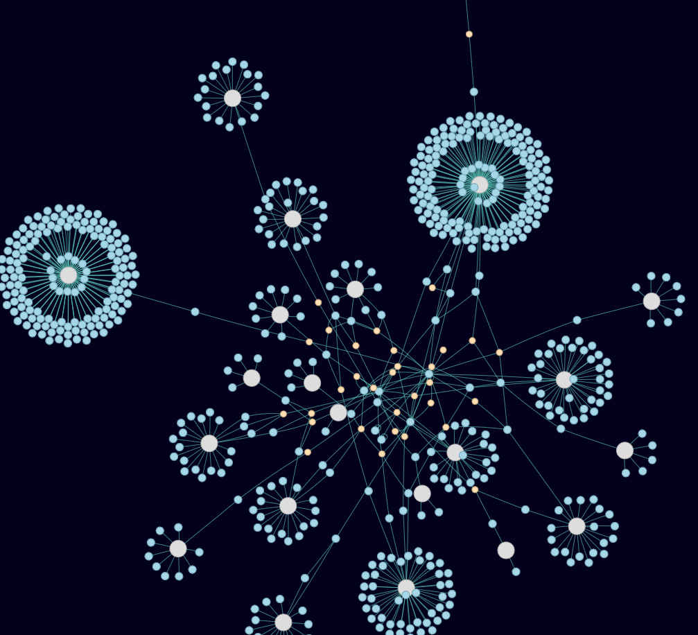
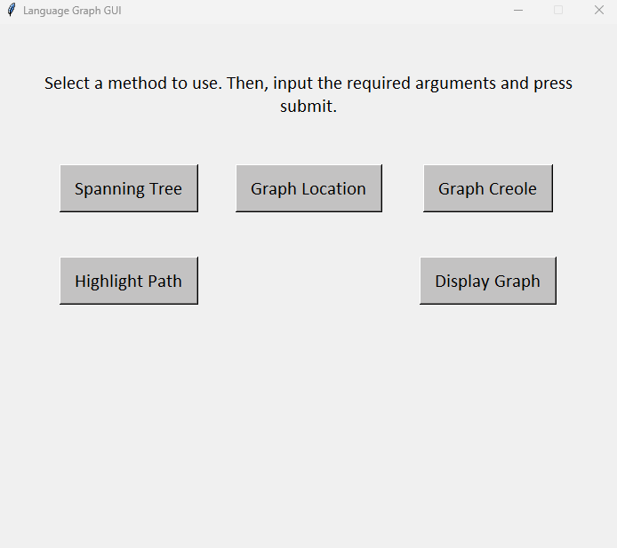
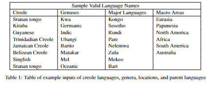

# World-Language-Graph-3D 🌎

## Introduction
* In linguistics, a creole language forms when multiple languages are spoken in the same region blend, simplifying the outcome. This new hybrid language stabilizes and becomes distinct as a natural language. For instance, Singlish, spoken in Singapore, emerges from interactions between English, Hokkien, Malay, Cantonese, and Mandarin. This creates a network linking Creole languages and their parent languages through linguistic exchanges. Languages are categorized into groups called genera, akin to language families that unite languages with a common ancestor. Yet, as language families can be vast, comparing languages within them is challenging. Related languages are grouped to ease comparisons and reveal connections. A natural line of inquiry is then to investigate the nature of this network, and how different creole languages and genera interact with the complete network. This project aims to visualize the complete network of parent and Creole languages. This project aims to answer the question of  **How can the relationships between Creole languages and their parent languages be visualized?** 
## What it does 
* World-Language-Graph-3D takes data from [World Atlas of Language Structures Dataset (Kaggle)](https://www.kaggle.com/datasets/rtatman/world-atlas-of-language-structures) and [Atlas of Pidgin and Creole Language Structures (Kaggle)](https://www.kaggle.com/datasets/rtatman/atlas-of-pidgin-and-creole-language-structures) and combines them into a [Graph Abstract Data Type](https://en.wikipedia.org/wiki/Graph_(abstract_data_type)), and various graph searching algorithms are applied to generate 3D visuals on how the languages interconnect with each other. 

## How to use  
> ###### 1. Git clone the repository or download the project files 
> ###### 2. Install all requirements from requirements.txt
> ###### 3. Run the file named main  
> ###### 4. Play around with the GUI. Below is a table of valid inputs for Creole languages, genera, locations, and parent languages. You can generate your own graphs or check the visuals folder for some pre-generated visuals.
 

